- [El-Flow Design](#el-flow-design)
  - [基础节点 NODE TYPE](#基础节点-node-type)
    - [执行节点](#执行节点)
    - [逻辑节点](#逻辑节点)
  - [基础编排 STEP NODE](#基础编排-step-node)
    - [串行编排](#串行编排)
    - [并行编排](#并行编排)
  - [逻辑编排 LOGIC NODE](#逻辑编排-logic-node)
    - [条件编排 IFEL NODE](#条件编排-ifel-node)
    - [选择编排 SWITCH NODE](#选择编排-switch-node)
    - [循环编排 FOR NODE](#循环编排-for-node)
    - [循环编排 WHILE NODE](#循环编排-while-node)
  - [逻辑结构体 SUB NODE(重要)](#逻辑结构体-sub-node重要)
    - [理解逻辑结构体](#理解逻辑结构体)
    - [为什么这么设计](#为什么这么设计)

# El-Flow Design
图形化流程，更灵活的控制业务逻辑，即流程图 --> 表达式 --> 业务逻辑
[LiteFlow](https://liteflow.yomahub.com/)
[LogicFlow](https://site.logic-flow.cn/docs/#/)

## 基础节点 NODE TYPE
### 执行节点
- STEP: 表示执行步骤
- SUB：表示逻辑操内执行子步骤
>执行步骤即 `lite flow` 的组件概念
### 逻辑节点
- IFEL: `if...else...` 条件逻辑
- SWITCH: `switch` 选择逻辑
- FOR: `for` 循环逻辑
- WHILE: `while` 循环逻辑

以下内容将逻辑节点统一称为**逻辑节点（Logic Node）**
> IFEEL、SITCH、FOR、WHILE 为逻辑操作, 其内部执行的结构体, 执行步骤必须用 `SUB NODE` 表示，而非 `STEP NODE`

## 基础编排 STEP NODE
### 串行编排
```xml
<chain name="chain1">
    THEN(a, b, c);
</chain>
```
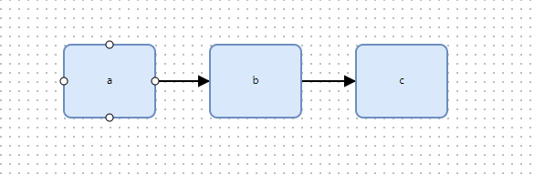

### 并行编排
基础并行
```xml
<chain name="chain1">
    THEN(a, WHEN(b,c))
</chain>
```
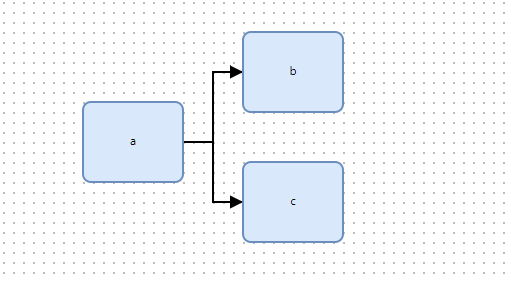

嵌套并行
```xml
<chain name="chain1">
    THEN(a, WHEN(THEN(b, WHEN(d,e)),THEN(c, WHEN(f,g,h))))
</chain>
```
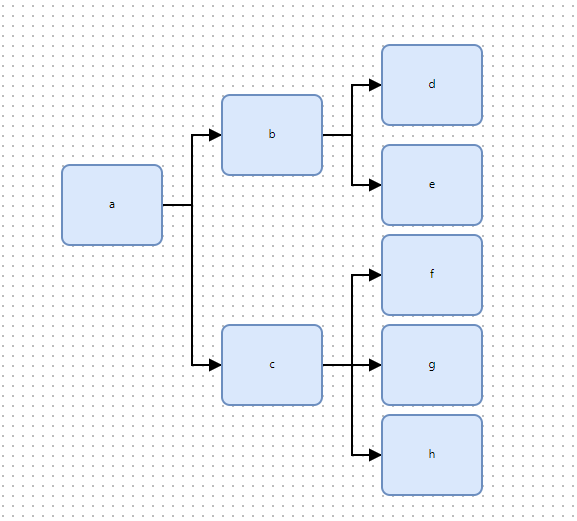

交点并行
```xml
<chain name="chain1">
    THEN(a, WHEN(b,c), d)
</chain>
```
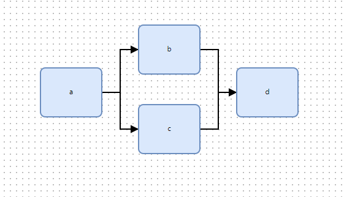


更复杂的例子
```xml
<chain name="chain1">
    THEN(a, b, c, WHEN(THEN(d, e),f), g, WHEN(THEN(h, j),i))
</chain>
```
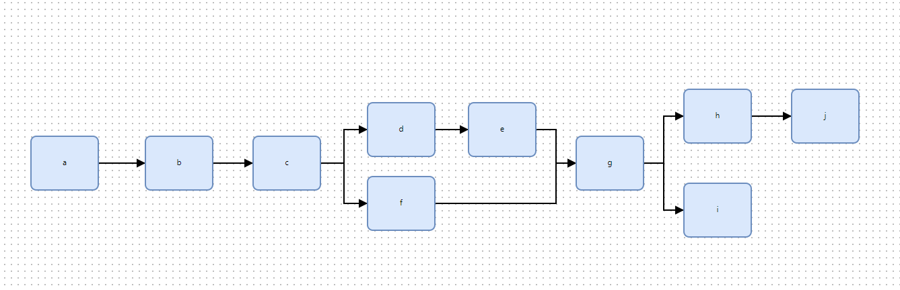

## 逻辑编排 LOGIC NODE
### 条件编排 IFEL NODE
基础条件编排
```xml
<!-- 组件 x 结果为true执行组件 b -->
<chain name="chain1">
THEN(a, IF(x, b))
</chain>
```
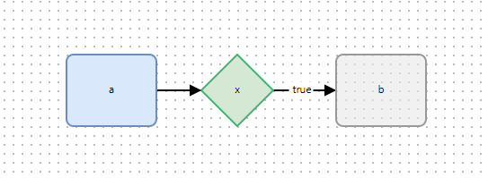

```xml
<!-- 组件 x 结果为true执行组件 b, 否则执行c -->
<chain name="chain1">
THEN(a, IF(x, b).ELSE(c))
</chain>
```
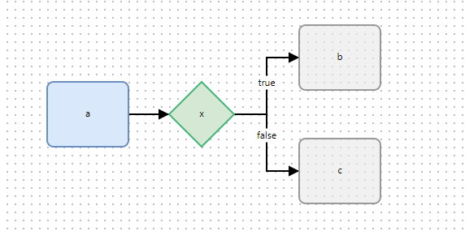

>- 当指定 `true` 和 `false` 时，会按照指定生成表达式
>- 当未指定  `true` 和 `false` 时，默认为 谁先连接线到 `IFEL` 节点谁为true执行的规则（比如c先用线连接到x节点，则`true`执行c, `false` 执行b）


嵌套条件编排
```xml
<chain name="chain1">
THEN(a, IF(x, b).ELSE(IF(y, c).ELSE(d)))
</chain>
```
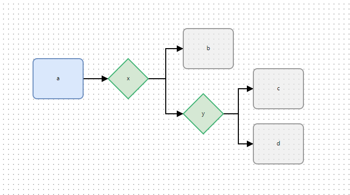

更复杂的例子
```xml
<chain name="chain1">
    THEN(a, IF(x, THEN(b, e, f, WHEN(i,h))).ELSE(IF(y, c).ELSE(THEN(d, IF(z, g)))))
</chain>
```
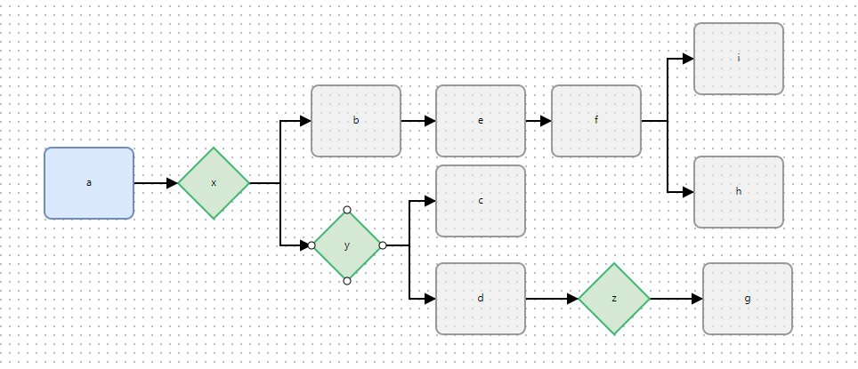

### 选择编排 SWITCH NODE
基础选择编排
```xml
<!-- 组件 x 结果为1执行a  为2执行b 为3执行c-->
<chain name="chain1">
SWITCH(x).TO(a,c,b)
</chain>
```
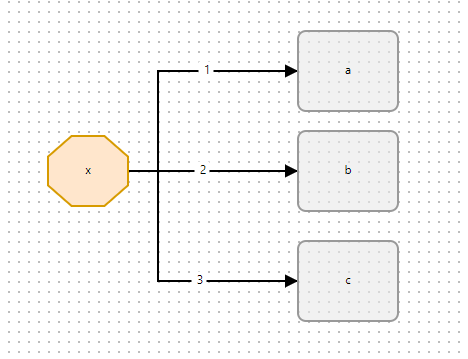

嵌套选择编排
```xml
<chain name="chain1">
    THEN(a, SWITCH(x).TO(a,b,THEN(c, SWITCH(y).TO(e,f))))
</chain>
```

>- 当指定 `SWITCH NODE` 的值时，按指定值大小优先级，值越小优先级越高（只是试图，非后端逻辑）
>- 当未指定   `SWITCH NODE` 时，默认为谁先连接线到 `SWITCH NODE` 谁的优先级高

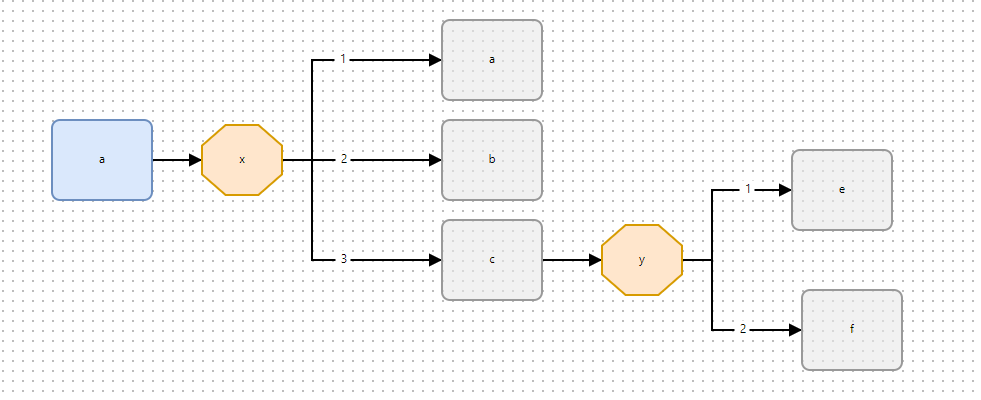

更复杂的例子
```xml
<chain name="chain1">
    THEN(a, SWITCH(x).TO(THEN(a, h, SWITCH(z).TO(THEN(i, WHEN(j,k)))),b,THEN(c, SWITCH(y).TO(THEN(e, m, n),f))))
</chain>
```
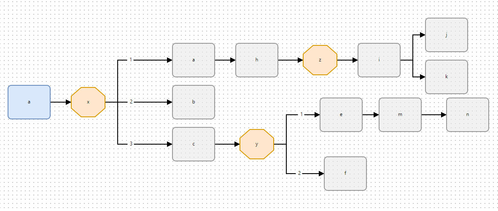

### 循环编排 FOR NODE
固定次数编排
```xml
<chain name="chain1">
    FOR(5).DO(a)
</chain>
```
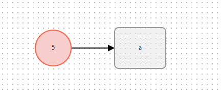

计数组件编排，参考[次数循环组件](https://liteflow.yomahub.com/pages/5f971f/)
```xml
<chain name="chain1">
    FOR(f).DO(a)
</chain>
```
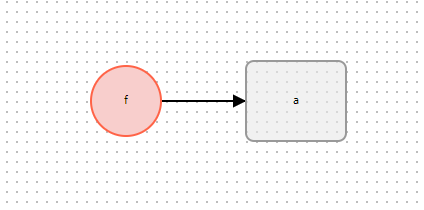

嵌套编排
```xml
<chain name="chain1">
    FOR(f).DO(THEN(a, FOR(5).DO(b)))
</chain>
```
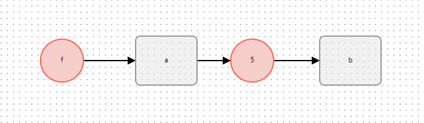

更复杂的例子
```xml
<chain name="chain1">
    FOR(f).DO(WHEN(THEN(a, c),THEN(b, WHEN(e,f))))
</chain>
```
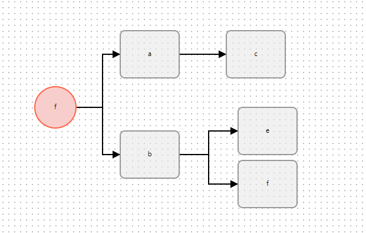

```xml
<chain name="chain1">
    FOR(f).DO(WHEN(THEN(a, c, FOR(q).DO(f)),THEN(b, FOR(p).DO(WHEN(d,e)))))
</chain>
```
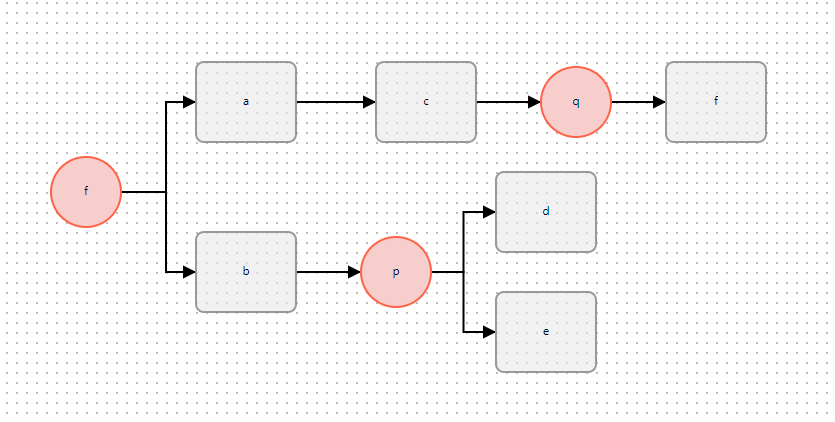

### 循环编排 WHILE NODE
> `WHILE` 和 `FOR` 的逻辑一致，只是用不同颜色区分的两种循环逻辑
```xml
<chain name="chain1">
    THEN(a, WHILE(x).DO(WHEN(THEN(b, c),d)))
</chain>
```
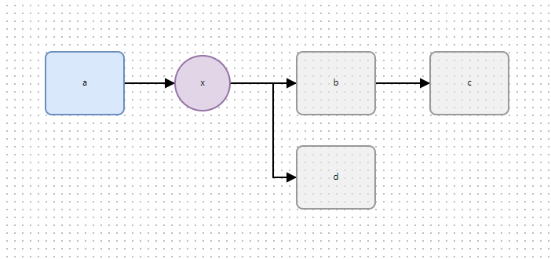

## 逻辑结构体 SUB NODE(重要)
### 理解逻辑结构体
**逻辑结构体**是什么？ 所有的逻辑运算都有其内部逻辑，也就是 `coding` 过程中的大括号的内部逻辑
```js
// IFEL
if (condition) {
    // 逻辑结构体
}

// SWITCH NODE
switch (key) {
    // 逻辑结构体
}

// FOR NODE
for (let i = 0; i < array.length; i++) {
    // 逻辑结构体（循环体）
}

// WHILE NODE
while (condition) {
    // 逻辑结构体
}
```
看图说话，红框内为逻辑结构体
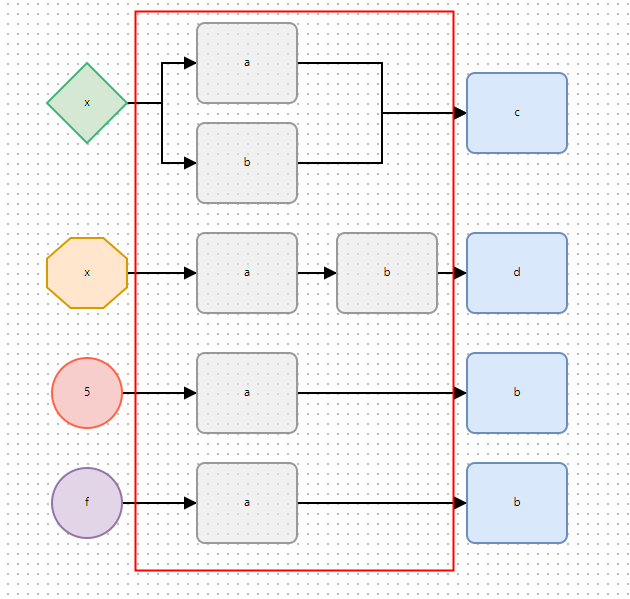

**为什么这么做？**
- 在复杂的流程图中能更清晰的看出主次逻辑，更容易理解整体的流程
- 更重要的是标注清楚 **逻辑节点** 的出口在哪里

**你需要遵守的规则**
- 逻辑结构体内部节点 **必须且只能用`SUB NODE`**
- 逻辑结构体的出口节点 **有且只能有一个**
- 逻辑节点的出口节点 **必须且只能用`STEP NODE`**


> 规则适用于所有逻辑节点，注意理解这个很重要，否则会抛异常
### 为什么这么设计
逻辑结构体需要明确内部和外部的后续执行，也就是 **出口节点**，比如看下面这张图，只有最后一个节点有区别，一个是 `STEP NODE`，另一个是`SUB NODE`, 思考一下表达式有什么不同？
 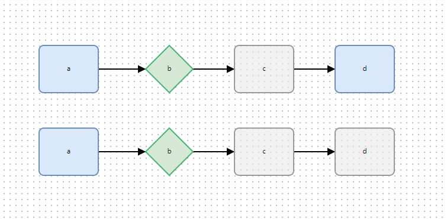

```xml
<!--STEP NODE-->
<chain name="chain1">
    THEN(a, IF(b, c), b)
</chain>

<!--SUB NODE-->
<chain name="chain1">
    THEN(a, IF(b, THEN(c, d)))
</chain>
```
表达式完全不同的执行逻辑，是否理解了为什么 **逻辑节点** 要 **出口节点**

为什么**出口节点只能有一个**？
你可能想说下图这样 `节点c` 和 `节点d` 可以看做是一个并行出口， 即 `THEN(a, IF(x, b), WHEN(c, d))`

 
 
 那稍微拿出一张复杂的图，阁下该如何应对？如果是更复杂的呢？
 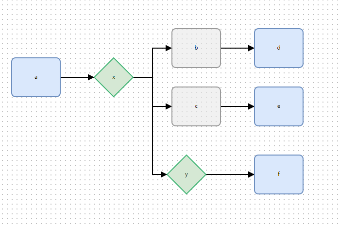

 是否更复杂的图让人更难理解，规则是为了让图画的更加清晰更容易让人理解