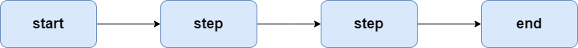
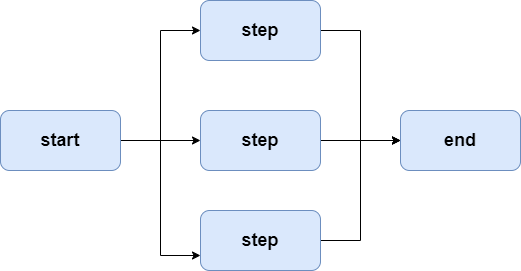
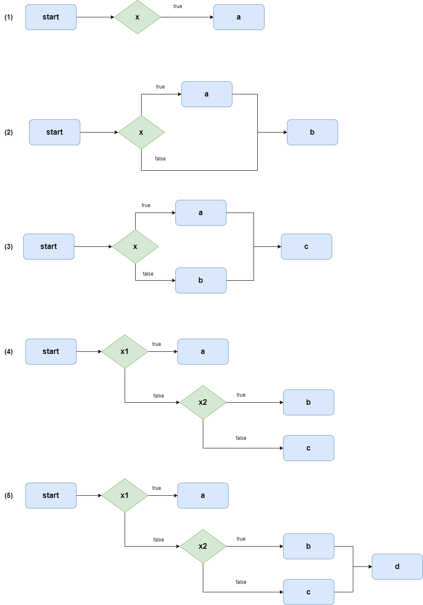
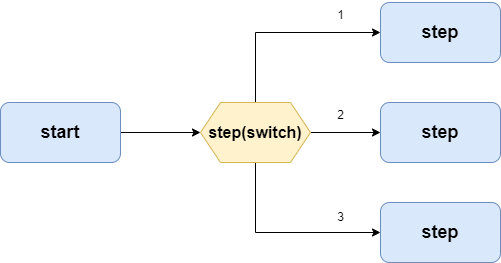
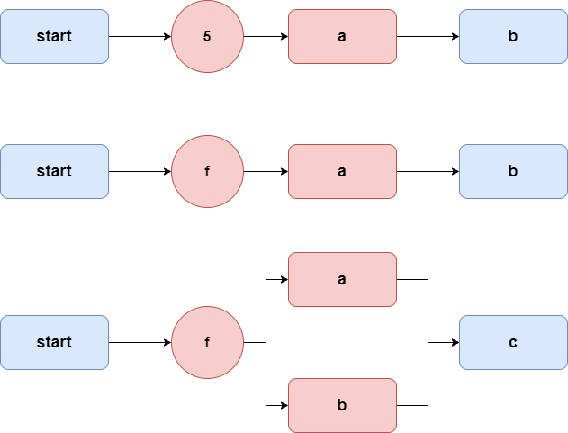
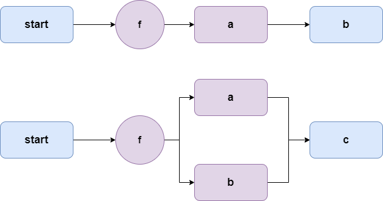

# El-Flow Design

### Basic shape
- rect: 表示执行步骤
- diamond: 表示条件判断，颜色区分是 `IF` 或者 `SWITCH` （备选方案使用多边形表示 `SWITCH`）
- circle: 表示循环， 颜色区分是 `FOR` 或者 `WHILE`

### Basic Flow
##### 串行编排
```xml
<chain name="chain1">
    THEN(a, b, c, d);
</chain>
```


##### 并行编排
```xml
<chain name="chain1">
    WHEN(a, b, c);
</chain>

```


##### 条件编排 if...else
```xml
图(1)
<chain name="chain1">
    THEN(
        IF(x, a)
    );
</chain>

图(2)
这里和else的区别，判断b节点是不是a的后续节点，是则图2，否则图3
<chain name="chain1">
    THEN(
        IF(x, a),
        b
    );
</chain>

图(3) 一种是三元表达式 一种是else
<chain name="chain1">
    THEN(
        IF(x, a).ELSE(b),
        c
    );
</chain>

<chain name="chain1">
    THEN(
        IF(x, a, b),
        c
    );
</chain>

图(4)
<chain name="chain1">
    IF(x1, a).ELIF(x2, b).ELSE(c);
</chain>

图(5)
<chain name="chain1">
    THEN(
        IF(x1, a).ELIF(x2, b).ELSE(c),
        d
    );
</chain>
```



##### 条件编排 switch
```xml
<chain name="chain1">
    SWITCH(a).to(b, c, d);
</chain>

```


 
##### 循环编排 for
表达式内部 `f` 参考[次数循环组件](https://liteflow.yomahub.com/pages/5f971f/)
```xml
<chain name="chain1">
    THEN(
        FOR(5).DO(THEN(a)),
        b
    );
</chain>

<chain name="chain1">
    THEN(
        FOR(f).DO(THEN(a)),
        b
    );
</chain>

<chain name="chain1">
    THEN(
        FOR(f).DO(THEN(WHEN(a, b))),
        c
    );
</chain>

```


##### 循环编排 while
表达式内部 `w` 参考[条件循环组件](https://liteflow.yomahub.com/pages/e6995e/)
```xml
<chain name="chain1">
    THEN(
        WHILE(w).DO(THEN(a)),
        b
    );
</chain>

<chain name="chain1">
    THEN(
        WHILE(w).DO(THEN(WHEN(a, b))),
        c
    );
</chain>
```
