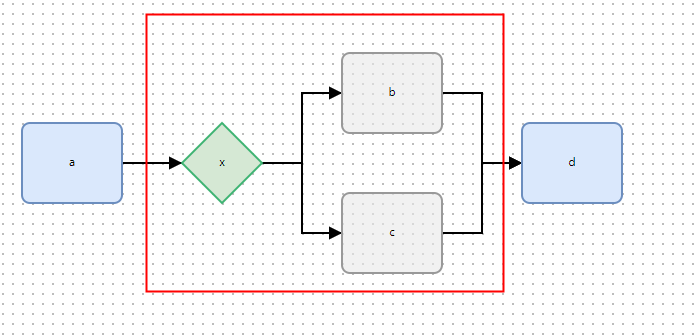

- [El-Flow Design](#el-flow-design)
  - [基础节点 NODE TYPE](#基础节点-node-type)
    - [执行节点](#执行节点)
    - [逻辑节点](#逻辑节点)
  - [基础编排 STEP NODE](#基础编排-step-node)
    - [串行编排](#串行编排)
    - [并行编排](#并行编排)
  - [逻辑编排](#逻辑编排)
    - [条件编排 IFEL NODE](#条件编排-ifel-node)
    - [选择编排 SWITCH NODE](#选择编排-switch-node)
    - [循环编排 FOR NODE](#循环编排-for-node)
    - [循环编排 WHILE NODE](#循环编排-while-node)
  - [逻辑结构体 SUB NODE(重要)](#逻辑结构体-sub-node重要)

# El-Flow Design
图形化流程，更灵活的控制业务逻辑，即流程图 --> 表达式 --> 业务逻辑
[LiteFlow](https://liteflow.yomahub.com/)
[LogicFlow](https://site.logic-flow.cn/docs/#/)

## 基础节点 NODE TYPE
### 执行节点
- STEP: 表示执行步骤
- SUB：表示逻辑操内执行子步骤
>执行步骤即 `lite flow` 的组件概念
### 逻辑节点
- IFEL: `if...else...` 条件逻辑
- SWITCH: `switch` 选择逻辑
- FOR: `for` 循环逻辑
- WHILE: `while` 循环逻辑

> IFEEL、SITCH、FOR、WHILE 为逻辑操作, 其内部执行的结构体, 执行步骤必须用 `SUB NODE` 表示，而非 `STEP NODE`

## 基础编排 STEP NODE
### 串行编排
```xml
<chain name="chain1">
    THEN(a, b, c);
</chain>
```


### 并行编排
基础并行
```xml
<chain name="chain1">
    THEN(a, WHEN(b,c))
</chain>
```


嵌套并行
```xml
<chain name="chain1">
    THEN(a, WHEN(THEN(b, WHEN(d,e)),THEN(c, WHEN(f,g,h))))
</chain>
```


交点并行
```xml
<chain name="chain1">
    THEN(a, WHEN(b,c), d)
</chain>
```


更复杂的例子
```xml
<chain name="chain1">
    THEN(a, b, c, WHEN(THEN(d, e),f), g, WHEN(THEN(h, j),i))
</chain>
```


## 逻辑编排
### 条件编排 IFEL NODE
基础条件编排
```xml
<!-- 组件 x 结果为true执行组件 b -->
<chain name="chain1">
THEN(a, IF(x, b))
</chain>
```


```xml
<!-- 组件 x 结果为true执行组件 b, 否则执行c -->
<chain name="chain1">
THEN(a, IF(x, b).ELSE(c))
</chain>
```


>- 当指定 `true` 和 `false` 时，会按照指定生成表达式
>- 当未指定  `true` 和 `false` 时，默认为 谁先连接线到 `IFEL` 节点谁为true执行的规则（比如c先用线连接到x节点，则`true`执行c, `false` 执行b）


嵌套条件编排
```xml
<chain name="chain1">
THEN(a, IF(x, b).ELSE(IF(y, c).ELSE(d)))
</chain>
```


更复杂的例子
```xml
<chain name="chain1">
    THEN(a, IF(x, THEN(b, e, f, WHEN(i,h))).ELSE(IF(y, c).ELSE(THEN(d, IF(z, g)))))
</chain>
```


### 选择编排 SWITCH NODE
基础选择编排
```xml
<!-- 组件 x 结果为1执行a  为2执行b 为3执行c-->
<chain name="chain1">
SWITCH(x).TO(a,c,b)
</chain>
```


嵌套选择编排
```xml
<chain name="chain1">
    THEN(a, SWITCH(x).TO(a,b,THEN(c, SWITCH(y).TO(e,f))))
</chain>
```


更复杂的例子
```xml
<chain name="chain1">
    THEN(a, SWITCH(x).TO(THEN(a, h, SWITCH(z).TO(THEN(i, WHEN(j,k)))),b,THEN(c, SWITCH(y).TO(THEN(e, m, n),f))))
</chain>
```


### 循环编排 FOR NODE
固定次数编排
```xml
<chain name="chain1">
    FOR(5).DO(a)
</chain>
```


计数组件编排，参考[次数循环组件](https://liteflow.yomahub.com/pages/5f971f/)
```xml
<chain name="chain1">
    FOR(f).DO(a)
</chain>
```


嵌套编排
```xml
<chain name="chain1">
    FOR(f).DO(THEN(a, FOR(5).DO(b)))
</chain>
```


更复杂的例子
```xml
<chain name="chain1">
    FOR(f).DO(WHEN(THEN(a, c),THEN(b, WHEN(e,f))))
</chain>
```


```xml
<chain name="chain1">
    FOR(f).DO(WHEN(THEN(a, c, FOR(q).DO(f)),THEN(b, FOR(p).DO(WHEN(d,e)))))
</chain>
```


### 循环编排 WHILE NODE
> `WHILE` 和 `FOR` 的逻辑一致，只是用不同颜色区分的两种循环逻辑
```xml
<chain name="chain1">
    THEN(a, WHILE(x).DO(WHEN(THEN(b, c),d)))
</chain>
```


## 逻辑结构体 SUB NODE(重要)
上述的所有的逻辑节点 `(IFEL、SWITCH、FOR、WHILE)` 后跟的执行步骤节点全部为 `SUB NODE`, 主要是为了区分逻辑题和主逻辑，表达式内部的解析逻辑是，逻辑节点（IFEL, WITCH, FOR, WHILE）的子节点强制校验为 `SUB NODE`，否则会抛出错误信息，为什么这么做？
主要是为了区分主逻辑和子逻辑，如下图

此时可以很清晰的看出来主逻辑其实是 `a-if-b` 这样的一个串行关系， `IFEL` 内的逻辑和主逻辑无关，最终会执行 `d`
, 条件逻辑其实从树的角度来看至两个路径，`d` 却是路径的合并节点 

> 这个规则适用于所有逻辑节点

```xml


 